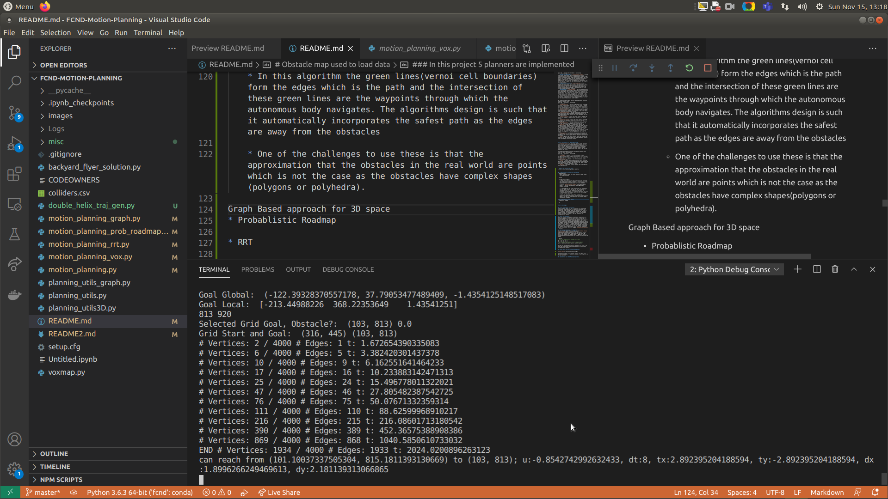

## 3D Motion Planning
This project consists of planning and executing a trajectory of a drone in an urban environment. Built using the event based framework, the complexity of path planning is explored in the 3D environment. The code is communicating with [Udacity's FCND Simulated Environment](https://github.com/udacity/FCND-Simulator-Releases/releases) using Udacity [Udacidrone](https://udacity.github.io/udacidrone/) API.


---

## Prerequites
To run this project successfully
* [anaconda](https://docs.anaconda.com/anaconda/install/) to use conda environment with Python 3.6. 

* `git clone https://github.com/udacity/FCND-Term1-Starter-Kit.git` to clone the starter kit and then cd FCND-Term1-Starter-Kit into that directory. If you have a windows machine, you must rename meta_windows_patch.yml to meta.yml as well.

* `conda env create -f environment.yml` to create the conda environment: this took me 20 minutes to run due to the large number of installs required.

* `source activate fcnd` or `conda activate fcnd` to activate the environment (you'll need to do this whenever you want to work in this environment).

* Finally you can [download the simulator here](https://github.com/udacity/FCND-Simulator-Releases/releases) as per your operating system.


# Required Steps for this project:
1. Load the 2.5D map in the colliders.csv file describing the environment.
2. Discretize the environment into a grid or graph representation.
3. Define the start and goal locations.
4. Perform a search using A* or other search algorithm.
5. Use a collinearity test or ray tracing method (like Bresenham) to remove unnecessary waypoints.
6. Return waypoints in local ECEF coordinates (format for `self.all_waypoints` is [N, E, altitude, heading], where the drone’s start location corresponds to [0, 0, 0, 0].
7. Write it up.
8. Congratulations!  Your Done!


## Project Description

#### 1. Provide a Writeup / README that includes all the rubric points and how you addressed each one.  You can submit your writeup as markdown or pdf.  

You're reading it! Below I describe how I addressed each rubric point and where in my code each point is handled.

### Explanation of the Starter Code

#### Difference between `backyard_flyer_solution.py` and `motion_planning.py`
* `motion_planning.py` is a modified version of the `backyard_flyer.py`; There is an additional planning state added to motion_planning.py that makes both the script different. Below are the state diagrams explaining the state and their respective transitions.


The state machine implemented on [`motion_planning.py`](./motion_planning_from_seed_project.py), adds another state to the previous one:


There is a new state, PLANNING, between ARMING and TAKEOFF. When the drone is at the state ARMING and it is actually armed (line 66) on the state_callback method (lines 61 to 72), the transition to PLANNING is executed on the method plan_path. This method is responsible to calculate the waypoints necessary for the drone to arrive at its destination.

Plan_path method:

* 2.5D map is loaded on line 133 using np.loadtxt from the colliders.csv
* The grid is then calculated at line 136 using the method create_grid from the module planning_utils.py.
* The goal grid is set 10 north and east from local position on line 144.
* In order to find the path to the goal, A* search algorithm is executed on line 151 using the a_star method from the module planning_utils.py.
* A list of waypoints are generated at line 157, and they are communicated to the simulator/drone  using the method send_waypoints at line 161.


#### 1. Functionality of `motion_planning.py`
These files contain planning implementation that includes...
* `motion_planning.py` : In this file , States is a class object that  contains various states defined as enums such as Manual and Arming etc. 
Then there is a MotionPlanning class that accepts Drone(a udacitydrone API object) as an input parameter and  also house a constructor that registers various callbacks those are used to communitcate with the drone running in the simulator. 
Various Message with corresponding Message IDs are broadcasted via the drone API as events ; these are recieved in the motion planning python script module through a tcp connection port which is following mavlink data framework that is generally used in the drone industry. The script or the python module use the same connection port to communicate the commands back to the drone running the simulator

Here's a table representing Messages and  corresponding callbacks linked to them 

Serial No. | Message IDs | Callbacks | Functioning
--- | --- | --- | ---
1 | **MsgID.LOCAL_POSITION** | `local_position_callback` |  Based on the state of the drone this callback executes waypoint transition(function responsible to take the first element of the waypoint list and set it as target position and command the local position and drone heading as per that, and pops out the first waypoint from the list) or landing transition if all the waypoints have been traversed and poped out of the waypoint list that is the list is empty and the local velocity of the drone is less than 1.0 unit.
2 | **MsgID.LOCAL_POSITION** | `velocity_callback` | This callback checks if flight state or the drone state ; if it is landing then it checks if the difference between altitude of the global position returned and the altitude of the global home position is less than 0.1 and  also the absolute value of the current local position's altitude is less than 0.01; if so it executes/triggers disarming transition
3 | **MsgID.STATE** | `state_callback` | This callback executes a state machine logic that triggers appropriate transition function calls depending on the current drone state. First in_mission is checked and it has to be set to true in order to execute further; then the state of the drone is checked: if it is manual , then arming transition of the drone happens; if the state is arming and the armed bit is set then plan path module is called; now if the state is planning then takeoff transition happens and lastly, if the state is disarming and armed and guided bit both are not set then manual transition is called finally.


The callbacks refered above make use of the following functions to perform varoius tasks
Serial No. | Functions |  Functioning
--- | --- | --- 
1 | `arming_transition` | sets the flight/drone state as arming; then sends an arm command to the drone and then sends a command to the drone to switch to guided (autonomous) mode ; essentially control the drone with code. All these commands are communicated via the mavlink complaint tcp connection port.
2 | `takeoff_transition` | sets the flight/drone state to takeoff then executes takeoff command; This command the drone to takeoff to the target_alt (in meters) that is passed to the drone object as an constructor intialization routine.
3 | `waypoint_transition` | sets the flight state to waypoint and target position as the first element of the waypoint list ans then commanding the local position and drone heading as per this target position set.
4 | `landing_transition` | sets the flight state to landing and executes the command to land the drone to land at its current position
5 | `disarming_transition` | sets the flight state to disarming and executes the command to disarm the drone and finally releasing the control of drone and commands the drone to switch to manual mode 
6 | `manual_transition` | sets the flight state to manual and stops the  connection to the drone and closes the log.
7 | `plan_path` | Loads the 2.5 Dimensional  map from the colliders.csv file, then creating grid using the loaded data and the functions from planning_utils.py, the create grid function from the planning_utils file creates the grid of obstacles and the simulated environment, further this function uses a_star function that is an implementation of A* search algorithm to find the path for the given start and goal position. This function finally returns path as a list of waypoints for the drone to travel.
8 | `send_waypoints` | converting the waypoints returned by the plan_path module into raw bytes and packing them to be written/sent back to the drone using the mavlink complaint tcp connection port created.
9 | `start` | Finally the start function starts the logging and connection for the simulator/drone and python module to interact using mavlink data transmission protocol.


#### 2. Functionality of  `planning_utils.py`
*  `planning_utils.py` : In this file, we have helper functions those are used by the motion planning module declared in the motion_planning script to navigate/find the path/planning  from start to the goal position. It also declares an Action class object, which is represented by a 3 element tuple, where the first 2 values are the delta of the action relative to the current grid position. The third and final value is the cost of performing the action.

Following are the helper functions in the file planning_utils along with their funcitonality
Serial No. | Functions |  Functioning
--- | --- | --- 
1 | `create_grid` | Returns a grid representation of a 2D configuration space based on given obstacle data, drone altitude and safety distance arguments retrieved from 2.5D map loaded from colliders.csv.
2 | `valid_actions` | Returns a list of valid actions given a grid and current node.
3 | `a_star` | function that implements a star search algorithm that use the heuristic(h cost(euclidean distance)) along with the action cost(g cost) to deduce the total cost and  based on that decide which grid point to travel to next.
4 | `heuristic` | euclidean distance between the current positon to the goal position.


# Obstacle map used to load data 
2.5D MAP, lacks representing complex geometry


* The whole idea behind this data structure is to preserve the  3D height knowledge of an object in the map. So the grids store the value that correspond to height of the obstacle in that area/grid

* Unable to preserve or represent obstacles those are complex in geometry.


### In this project 5 planners are implemented

* 2D Grid: 


   * Discretization of the state space as a 2D grid with infeasible grids and free grids through which the autonomous vehicle navigate.
   * Possible actions can be moving right , left , top and bottom but also diagonally. So generally the cost involved in the planner for diagonally actions/movements is slightly more than  right , left , top and bottom actions.

   * Result: (Only 2D info required as points)
     * Run it with `motion_planning.py`
       ```python
          # with goal as local coordinate system  
          python motion_planning.py --local_goal="(290,300)"
          # with goal as global coordinate system
          python motion_planning.py --global_goal="(-122.400424, 37.794026))"
          # with goal as grid coordinate system defined by us in the 921 x 921 grid
          python motion_planning.py --grid_goal="(488,182)"
          # without goal , script selects the goal on its own 
          python motion_planning.py
       ```

* 3D Grid(VoxMap):

    

  * A 3D voxel grid that contains obstacles, non obstacle grids placed in a 3D space.
  * A voxel is a pixel alternate in 3D space, The more the resolution of the voxel grid the better it will represent the geometry of the obstacle while the motion planning.
  * A voxel map is generated by iterating through the voxel grid and using algorithms like Bresenham to draw lines or edges via checking the permisible actions and arriving at a solution to reach to the goal.
  *  Memory instensive if we are trying to solve a large volume with high resolution. Also with the increase in the size of the state vector, the memory consumption rises exponentially.
  * Result:(3D info required as points)
      * Run it with `motion_planning_vox.py`
        ```python
            # with goal as local coordinate system  
            python motion_planning_vox.py --local_goal="(290,300,15)"
            # with goal as global coordinate system
            python motion_planning_vox.py --global_goal="(-122.400424, 37.794026,10))"
            # with goal as grid coordinate system defined by us as 3D vox grid(Top of the next building)
            python motion_planning_vox.py --grid_goal="(600,200,100)"
            # without goal , script selects the goal on its own 
            python motion_planning_vox.py
        ```
      * Top of the next building `python motion_planning_vox.py --grid_goal="(600,200,100)"`
      
      

      * To the hole between the buildings `python motion_planning_vox.py --grid_goal="(320, 545, 5)"`
      
      


Graph Based Motion Planning

* 2D Graph(Vernoi Graphs): 

    
    

    * Medial Axis Transform: In this architecture and algorithm the obstacles and grid is divided into fly and no fly zones and iteratively the path is selected with the grid cells are equidistant from the two obstacles and is in the middle.
    
    * For this `motion_planning_graph.py` chose Vernoi Graph which is a specific implementation of the Medial Axis tranform algorithm.
    
    

    * In this algorithm the green lines(vernoi cell boundaries) form the edges which is the path and the intersection of these green lines are the waypoints through which the autonomous body navigates. The algorithms design is such that it automatically incorporates the safest path as the edges are away from the obstacles
    

    * One of the challenges to use these is that the approximation that the obstacles in the real world are points which is not the case as the obstacles have complex shapes(polygons or polyhedra).

    * Results:(Only 2D info required as points as target altitude is fixed)
        * Run it with `motion_planning_graph.py`
        ```python
            # with goal as local coordinate system  
            python motion_planning_graph.py --local_goal="(290,300)"
            # with goal as global coordinate system
            python motion_planning_graph.py --global_goal="(-122.400424, 37.794026)"
            # with goal as grid coordinate system defined by us as 3D vox grid(Top of the next building)
            python motion_planning_graph.py --grid_goal="(488,182)"
            # without goal , script selects the goal on its own 
            python motion_planning_vox.py
        ```
    
    
    


* For 3D space
    * Probablistic Roadmap:
      
      
      
      * Steps involved in Probablistic roadmap algorithm to find path

      
      

      
      * Result:(Only 2D info required as points as target altitude is fixed)
        * Run it with `motion_planning_prob_roadmap.py`
        ```python
            # with goal as local coordinate system  
            python motion_planning_prob_roadmap.py --local_goal="(290,300)"
            # with goal as global coordinate system
            python motion_planning_prob_roadmap.py --global_goal="(-122.400424, 37.794026)"
            # with goal as grid coordinate system defined by us as 3D vox grid(Top of the next building)
            python motion_planning_prob_roadmap.py --grid_goal="(488,182)"
            # without goal , script selects the goal on its own 
            python motion_planning_prob_roadmap.py
        ```
      * First the polygons are calculated and based on these polygon boundaries all the randomly selected states mentioned in above picture are kept or ignored based on whether they lie within the polygon boundaries and safety distance choosen.
      

    * RRT

      
      
      
      
      

      * How it looks after the search once the tree is built
      !

      * Results:(Only 2D info required as points as target altitude is fixed)
        * Run it with `motion_planning_rrt.py`
        ```python
            # with goal as local coordinate system  
            python motion_planning_rrt.py --local_goal="(290,300)"
            # with goal as global coordinate system
            python motion_planning_rrt.py --global_goal="(-122.400424, 37.794026)"
            # with goal as grid coordinate system defined by us as 3D vox grid(Top of the next building)
            python motion_planning_rrt.py --grid_goal="(488,182)"
            # without goal , script selects the goal on its own 
            python motion_planning_rrt.py
        ```
      
      
      
      
      
### Implementing Your Path Planning Algorithm

#### 1. Set your global home position
Here students should read the first line of the csv file, extract lat0 and lon0 as floating point values and use the self.set_home_position() method to set global home. Explain briefly how you accomplished this in your code.

My Implementation:
```python

# Read in obstacle map
        data = np.loadtxt('colliders.csv', delimiter=',', dtype='Float64',
                          skiprows=2)
        # Define a grid for a particular altitude and
        # safety margin around obstacles
        grid, north_offset, east_offset = create_grid(data, TARGET_ALTITUDE,
                                                      SAFETY_DISTANCE)
        grid_shape = grid.shape
        print("North offset = {0}, east offset = {1}".format(north_offset,
                                                             east_offset))

        # Define starting point on the grid (this is just grid center)
        # TODO: read lat0, lon0 from colliders into floating point values
        with open('colliders.csv') as f:
            first_line = f.readline().strip()
        latlon = first_line.split(',')
        lon0 = float(latlon[0].strip().split(' ')[1])
        lat0 = float(latlon[1].strip().split(' ')[1])

        # TODO: convert start position to current position
        # rather than map center
        # TODO: set home position to (lon0, lat0, 0)
        self.set_home_position(lat0, lon0, 0)

        
```


#### 2. Set your current local position
Here as long as you successfully determine your local position relative to global home you'll be all set. Explain briefly how you accomplished this in your code.

My Implementation:
```python

# TODO: retrieve current global position
        # TODO: convert to current local position using global_to_local()
        local_pos = global_to_local(self.global_position,
                                    global_home=self.global_home)
       


```
#### 3. Set grid start position from local position
This is another step in adding flexibility to the start location. As long as it works you're good to go!

My Implementation:

```python
north, east, att = local_pos
grid_start = (int(np.rint(north - north_offset)),
                      int(np.rint(east - east_offset)))
        print("Grid Start: ", grid_start)
```

#### 4. Set grid goal position from geodetic coords
This step is to add flexibility to the desired goal location. Should be able to choose any (lat, lon) within the map and have it rendered to a goal location on the grid.

My Implementation:

```python:
  # Read from the input argument parser
  if self.global_goal is not None:
            if len(self.global_goal) == 2:
                self.global_goal = (self.global_goal[0], self.global_goal[1],
                                    TARGET_ALTITUDE)
            self.global_to_grid(north_offset, east_offset)
        elif self.local_goal is not None:
            self.local_to_grid(north_offset, east_offset)

        goal_list = []

        # If goal location is in an obstacle
        goal_obs = True
        if self.grid_goal is not None:
            self.place_goal_in_grid(grid_shape)
            grid_goal = tuple(map(int, self.grid_goal))

            print("Goal is set to {0} with the parameter".format(grid_goal))
            goal_obs = grid[grid_goal[0], grid_goal[1]]
            if goal_obs:
                goal_list.append(grid_goal)

        # randomly select a goal
        dist_idx = 100.0
        goal_try = 0
        while goal_obs and goal_try < 100:
            goal_try += 1
            change = np.random.rand(3)
            change -= 0.5
            print("change", change)
            goal = (self.global_home[0] + change[0] / dist_idx,
                    self.global_home[1] + change[1] / (dist_idx),
                    self.global_home[2] + change[2] * 10.0)
            print("Goal Global: ", goal)
            local_goal = global_to_local(goal, global_home=self.global_home)
            print("Goal Local: ", local_goal)
            ng, eg, ag = local_goal
            grid_goal = (int(np.rint(ng - north_offset)),
                         int(np.rint(eg - east_offset)))

            if grid_goal[0] > grid_shape[0] - 2:
                grid_goal = (grid_shape[0] - 2, grid_goal[1])
            elif grid_goal[0] < 1:
                grid_goal = (1, grid_goal[1])
            if grid_goal[1] > grid_shape[1] - 2:
                grid_goal = (grid_goal[0], grid_shape[1] - 2)
            elif grid_goal[1] < 1:
                grid_goal = (grid_goal[0], 1)

            goal_obs = grid[grid_goal[0], grid_goal[1]]
            if goal_obs:
                goal_list.append(grid_goal)

        print('Grid Start and Goal: ', grid_start, grid_goal)

```

#### 5. Modify A* to include diagonal motion (or replace A* altogether)
Minimal requirement here is to modify the code in planning_utils() to update the A* implementation to include diagonal motions on the grid that have a cost of sqrt(2), but more creative solutions are welcome. Explain the code you used to accomplish this step.

My Implementation:

```python

# Adding diagnol movements as valid actions ; changes in planning_utils.py


# Assume all actions cost the same.
class Action(Enum):
    """
    An action is represented by a 3 element tuple.
    The first 2 values are the delta of the action relative
    to the current grid position. The third and final value
    is the cost of performing the action.
    """

    WEST = (0, -1, 1)
    EAST = (0, 1, 1)
    NORTH = (-1, 0, 1)
    SOUTH = (1, 0, 1)
    NORTH_WEST = (-1, -1, np.sqrt(2))
    NORTH_EAST = (-1, 1, np.sqrt(2))
    SOUTH_WEST = (1, -1, np.sqrt(2))
    SOUTH_EAST = (1, 1, np.sqrt(2))

    @property
    def cost(self):
        return self.value[2]

    @property
    def delta(self):
        return (self.value[0], self.value[1])

def valid_actions(grid, current_node, current_action=None, move=1):
    """
    Returns a list of valid actions given a grid and current node.
    """
    all_actions = list(Action)
    valid_actions_nodes = []
    n, m = grid.shape[0] - 1, grid.shape[1] - 1

    # To prevent zigzags add a cost to changing action
    # Move previous action first
    if (current_action is not None and
            current_action in all_actions):
        all_actions.remove(current_action)
        all_actions = [current_action] + all_actions

    for new_action in all_actions:
        new_x = current_node[0] + new_action.delta[0] * move
        new_y = current_node[1] + new_action.delta[1] * move

        if (new_x < 0 or new_x > n or
            new_y < 0 or new_y > m or
                grid[new_x, new_y]):
            pass
        else:
            valid_actions_nodes.append((new_action, (new_x, new_y)))

    return valid_actions_nodes

def a_star(grid, h, start, goal, max_move=1):
    path = []
    path_cost = 0
    queue = PriorityQueue()
    queue.put((0, start))
    visited = set(start)

    branch = {}
    found = False

    # To give information about the planning process
    depth = 0
    depth_act = 0
    report_int = 1024

    t0 = time.time()
    while not queue.empty():
        item = queue.get()
        current_node = item[1]
        current_q_cost = item[0]

        move = max_move

        if current_node in visited:
            continue

        visited.add(current_node)
        depth += 1

        if current_node == start:
            current_cost = 0.0
            current_action = None
        else:
            current_cost = branch[current_node][0]
            current_action = branch[current_node][2]
        if depth % report_int == 0:
            print("#Nodes:%s, #Actions:%s, Cost:%.2f, Currenct Node:%s,"
                  " Time:%.2f" % (depth, depth_act, current_cost,
                                  current_node, time.time() - t0))
            report_int *= 2

        current_h_cost = current_q_cost - current_cost

        if current_h_cost < np.sqrt(2) * float(max_move):
            move = 1
        else:
            move = max_move

        if current_node == goal:
            print('Found a path.')
            found = True
            print("#Nodes:%s, #Actions:%s, Cost:%.2f, Currenct Node:%s,"
                  " Time:%.2f" % (depth, depth_act, current_cost,
                                  current_node, time.time() - t0))
            break
        else:
            val_act_nod = valid_actions(
                grid, current_node, current_action, move)
            for action, next_node in val_act_nod:

                depth_act += 1

                action_cost = action.cost * move
                branch_cost = current_cost + action_cost
                h_cost = h(next_node, goal)
                queue_cost = branch_cost + h_cost
                if next_node in branch:
                    cost_in_branch = branch[next_node][0]
                    if branch_cost < cost_in_branch:
                        branch[next_node] = (branch_cost, current_node, action)
                        queue.put((queue_cost, next_node))
                else:
                    branch[next_node] = (branch_cost, current_node, action)
                    queue.put((queue_cost, next_node))

    path = []
    path_cost = 0
    if found:

        # retrace steps
        path = []
        n = goal
        path_cost = branch[n][0]
        while branch[n][1] != start:
            path.append(branch[n][1])
            n = branch[n][1]
        path.append(branch[n][1])
    else:
        print('**********************')
        print('Failed to find a path!')
        print('**********************')

    return path[::-1], path_cost


def heuristic(position, goal_position):
    return np.linalg.norm(np.array(position) - np.array(goal_position))

```

#### 6. Cull waypoints 
For this step you can use a collinearity test or ray tracing method like Bresenham. The idea is simply to prune your path of unnecessary waypoints. Explain the code you used to accomplish this step.

My Implementation:

```python


#Taking the determinant of the three points, it is just like calculating the area formed by the three points, if it is zero point are collinear, and therefore prunning the path could be performed

def collinearity_check(p1, p2, p3, epsilon=1e-6):
    m = np.concatenate((p1, p2, p3), 0)
    det = np.linalg.det(m)
    return abs(det) < epsilon


def prune_path(path, max_p=50):
    pruned_path = [p for p in path]
    # prune the path!
    i = 0
    ri = 0
    while i < len(pruned_path) - 2:
        p1 = point(pruned_path[i])
        p2 = point(pruned_path[i + 1])
        p3 = point(pruned_path[i + 2])
        if collinearity_check(p1, p2, p3) and ri < max_p:
            pruned_path.remove(pruned_path[i + 1])
            ri += 1
        else:
            i += 1
            ri = 0
    return pruned_path
```


## Extra Challenges


### Flying more complex trajectories
In this project, things are set up nicely to fly right-angled trajectories, where we ascend to a particular altitude, fly a path at that fixed altitude, then land vertically. In order to fly a trajectory, that has a variable altitude and  therefore sending altitude with each waypoint in order to  set the goal location on top of a building!, code was refactored to incorporate this feature. Already shown in the Voxel based 3D approach section above.

### Adjust your deadbands
Adjust the size of the deadbands around your waypoints is an important upgrade to the default setup as it is very important tune this parameter for avoiding the unneccesary time and resource wastage at the waypoint arrival, because drone keeps on correcting it's position fall under the radius of the circle around a waypoint as indicated by the deadband.Therefore, smaller the deadband more the accuracy of the drone touching the waypoint in the space but there is a tradeoff that comes along with this is that it will take more time and resource wastage as the drone needs decelerate to precisely fit into the deadband area around the waypoint. A nice approximation could be to make deadbands a function of velocity. Therefore changed `local_position_callback()` function. Implemented on line 72 in all the files in function `local_position_callback()` as `if dist_to_wp < 2.5 * (np.linalg.norm(self.local_velocity[0:2])):` being the deadband regulator code


### Add heading commands to your waypoints
This is a recent update! Make sure you have the [latest version of the simulator](https://github.com/udacity/FCND-Simulator-Releases/releases) to use this feature in your code. In the default setup, we had waypoints made up of NED position and heading with heading set to 0. Used this logic to incorporate the relative position into account for setting up the heading. 

```python
# Define two waypoints with heading = 0 for both
wp1 = [n1, e1, a1, 0]
wp2 = [n2, e2, a2, 0]
# Set heading of wp2 based on relative position to wp1
wp2[3] = np.arctan2((wp2[1]-wp1[1]), (wp2[0]-wp1[0]))

#Done as in line 315 of  the function plan_path of the class object `MotionPlanning(Drone)
head = []
            
        for t in range(len(pruned_path)):
                
            if t == 0:
                head.append(0)
            else:
                head.append(np.arctan2((pruned_path[t][1]-pruned_path[t-1][1]), (pruned_path[t][0]-pruned_path[t-1][0])))

        # Convert path to waypoints
        waypoints = [[p[0] + north_offset, p[1] + east_offset, p[2], head[i]] for i,p in enumerate(pruned_path)]

```
   * Difference with and without heading factor 
        
        

This may not be completely intuitive, but this will yield a yaw angle that is positive counterclockwise about a z-axis (down) axis that points downward.

### Double Helix path as reconnaissance pattern 

Added the reconnaissance feature in the `motion_planning_vox.py` as the module `create_helix_trajectory`, you can control the radius , time interval and preciseness of this double helix trajectory in the file `double_helix_traj_gen.py`. This module is called on the line 327 in the function `plan_path` of the class object `MotionPlanning(Drone)`
* Usage: (To be used specially when you know the goal is at the roof of a building)(By default reconnaissance is "No")
```python

python motion_planning_vox.py --grid_goal="(600,200,100)" --reconnaissance="Yes"
```


 Being an autonomous first responder vehicle this path  to a particular building or a location, could be an useful pattern to survey the scene!


## Current Limitations and Future Scope:

* RRT and Probablistic roadmap these two graph based path finding algorithms are quite slow on the CPU based implementation of these python scripts; specially the graph building and tree building takes a lot of time.  In future  one can use numba pyhton package to use jit and cuda decorators to the function those are responsible for the tree and graph building, so that these function those are resource expensive can run as a GPU kernel.
* Deadband optimization; current implementation of deadband as a function of velocity of the autonomous vehicle is not good enough some more flexible technique needs to be incorporated in this. The effect is visible when the drone gets quite slow.


## Utils

* `planning_utils.py`
* `planning_utlis3D.py`
* `planning_utils_graph.py`
* `voxmap.py`
* `double_helix_traj_gen.py`